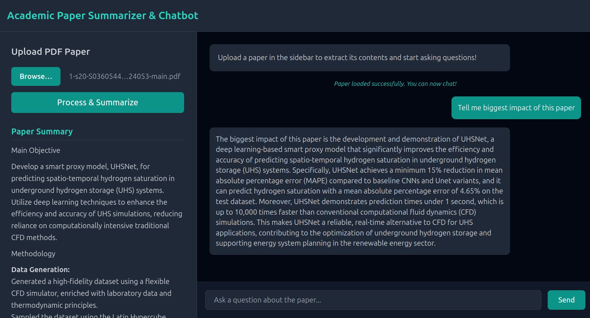

# AI Academic Paper Summarizer & Chatbot

A lightweight, full-stack web workspace built using **Flask**, **Tailwind CSS**, and **Hugging Face's Serverless Inference API** to instantly summarize and contextually chat with research papers (PDF format).

## Features
- **Instant Structured Summaries:** Extracts the Main Objective, Methodology, Key Findings, and Limitations using the high-performance `Qwen/Qwen2.5-7B-Instruct` model.
- **Context-Aware Technical Chat:** Features an interactive chat panel to query the document text directly in real time.
- **Server-Side Context Management:** Stays decoupled from browser cookie limits to support deep document text tracking.

## Quick Start



### 1. Clone the Repository
```bash
git clone https://github.com/Milad-asghari/paper-summarizer-chatbot.git
cd paper-summarizer-chatbot
